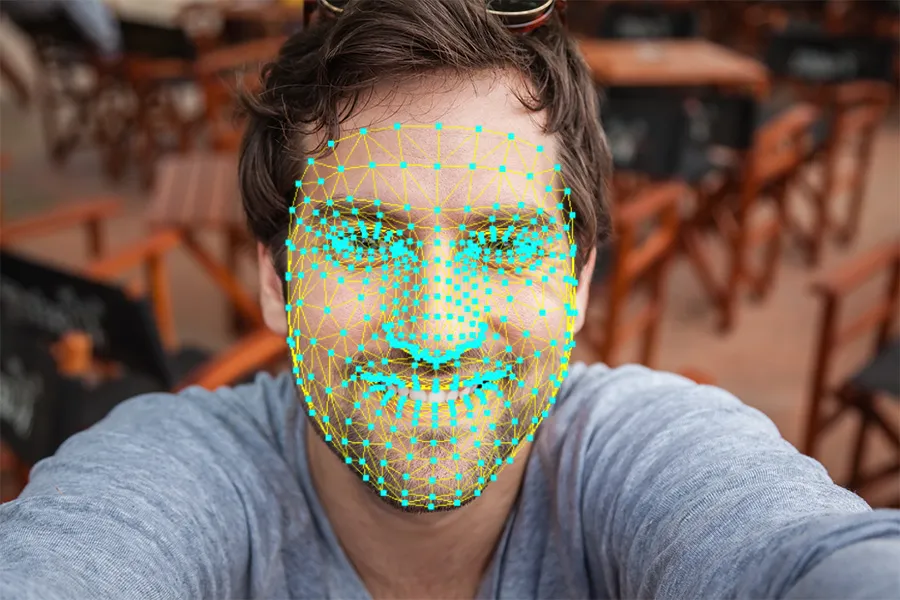

# <div align="center"></div> SevenEBasic: Detección y análisis de expresiones faciales asociadas a las siete emociones básicas de Paul Ekman

SevenEBasic es una aplicación diseñada para detectar y analizar las siete emociones básicas según Paul Ekman en tiempo real, ayudando a los empresarios a monitorear el bienestar emocional de sus empleados. Utilizando inteligencia artificial y tecnologías de visión por computadora como MediaPipe, la aplicación permite analizar las expresiones faciales de los empleados durante reuniones o entrevistas, proporcionando información valiosa sobre su estado emocional.

## Tecnologías Utilizadas

SevenEBasic utiliza tecnologías avanzadas para el análisis de expresiones faciales en tiempo real, integrando inteligencia artificial y visión por computadora. Además, utiliza  <a target="_blank" href="https://raw.githubusercontent.com/devicons/devicon/master/icons/python/python-original.svg" style="display: inline-block;"></a>  como lenguaje principal de desarrollo, aprovechando la poderosa combinación de <a target="_blank" href="https://www.vectorlogo.zone/logos/tensorflow/tensorflow-icon.svg" style="display: inline-block;"></a>  para entrenar y ejecutar modelos de aprendizaje automático que mejoran la precisión del análisis facial.


### <a target="_blank" href="https://viz.mediapipe.dev/logo.png" style="display: inline-block;"></a> MediaPipe y FaceMesh

MediaPipe es una biblioteca de código abierto desarrollada por Google, especializada en el procesamiento de datos en tiempo real. En SevenEBasic, se utiliza el modelo **FaceMesh**, que permite detectar hasta 468 puntos clave en el rostro humano, proporcionando una representación detallada de las expresiones faciales.

FaceMesh destaca por:

- **Precisión y velocidad:** Procesa datos faciales en tiempo real con alta eficiencia.
- **Compatibilidad multiplataforma:** Funciona en dispositivos de escritorio y móviles.
- **Facilidad de integración:** Se combina perfectamente con TensorFlow para tareas de análisis avanzado.
<div align="center"></div>

## Entrenamiento del Modelo IA con TensorFlow

Para el análisis de emociones en tiempo real, SevenEBasic utiliza un modelo de inteligencia artificial previamente entrenado con TensorFlow. Este modelo fue entrenado utilizando dos conjuntos de imágenes específicas, lo que permitió mejorar progresivamente su precisión en la detección de las emociones básicas:

### Facial Expressions Training Data
<a href="https://www.kaggle.com/datasets/noamsegal/affectnet-training-data" target="_blank"></a>

- **Cantidad de imágenes:** 26,061 
- **Resolución:** 96x96 píxeles
- **Formato:** PNG
- **Resultados iniciales:** Una precisión del 54.04% y val_accuracy del 56.41%.

<div align="center"></div>

Aunque este dataset permitió construir un modelo funcional, su baja precisión inicial llevó a un reentrenamiento con un segundo conjunto de datos.

### Extended and Augmented Google FER
<a href="https://www.kaggle.com/datasets/prajwalsood/google-fer-image-format" target="_blank"></a>

- **Cantidad de imágenes:** 35,887 
- **Resolución:** 48x48 píxeles
- **Formato:** PNG
- **Resultados tras el reentrenamiento:** Una precisión mejorada del 76.16% y val_accuracy del 80.30%.

<div align="center"></div>

Este proceso de reentrenamiento ajustó el modelo inicial para mejorar su capacidad de clasificar las emociones básicas: felicidad, tristeza, sorpresa, miedo, ira, disgusto y neutral.

Es importante destacar que **SevenEBasic utiliza este modelo preentrenado**, el cual se integra directamente en la aplicación para ofrecer análisis en tiempo real.

## Factores Clave para el Correcto Funcionamiento

Para garantizar un análisis preciso y efectivo de las emociones básicas en tiempo real, es importante tener en cuenta los siguientes factores:

### 📷 Resolución de la Cámara

- Se recomienda el uso de cámaras con una resolución mínima de **480p**.
- Cámaras de menor resolución pueden comprometer la detección de puntos faciales clave, afectando la precisión del análisis.

### 💡 Iluminación

- Una iluminación adecuada es esencial para capturar detalles faciales de calidad.
- Se sugiere usar luz natural o artificial que ilumine uniformemente el rostro del usuario, evitando sombras fuertes.

### 🧑 Posición del Usuario

- El rostro debe estar bien centrado y orientado hacia la cámara.
- El usuario debe estar a una distancia adecuada para asegurar que los puntos clave faciales sean detectados correctamente.

### 🖥️ Capacidad de Procesamiento

- La aplicación ha sido probada en equipos con especificaciones mínimas (Intel Celeron N4500, 8 GB RAM) y óptimas (Intel Core i5-8300H, 16 GB RAM).
- Aunque puede ejecutarse en dispositivos de gama baja, se recomienda usar equipos con mayor capacidad de procesamiento para mejorar la fluidez y minimizar el uso de CPU y RAM.

## Pantallas de la Aplicación

### 1. Pantallas de Login y Registro
<div align="center">
  
</div>

- Es la entrada principal al sistema. Solicita el nombre de usuario y la contraseña. Si los datos son correctos, el usuario accede a la pantalla principal.

  En caso de no tener una cuenta, se puede registrar haciendo clic en el botón "Registrarse".

<div align="center">
  
</div>

- Permite crear una nueva cuenta ingresando un nombre de usuario, email y contraseña. Una vez completado el formulario, el usuario es redirigido al login.

### 2. Pantalla Principal
<div align="center">
  
</div>

-  En esta pantalla se visualiza todos los usuarios registrados en forma de lista, con sus datos respectivos y una imagen del usuario.
  
   Además, se muestra una sección de filtro, tanto como buscador de usuarios y un filtro visual de forma de grafico de barras, que permite filtrar los análisis de los usuarios según criterios como edad, género y actividad.

   La pantalla principal incluye opciones para:  
   - Agregar usuario.  
   - Agregar actividad.
  
### 3. Gestión de Actividad
<div align="center">
  
</div>

- Permite administrar las actividades asociadas a los usuarios del sistema.

  Las funcionalidades principales son:  
  - Registrar nuevas actividades introduciendo un nombre único para cada actividad.  
  - Editar actividades existentes, permitiendo actualizar el nombre según sea necesario.  
  - Eliminar actividades previamente registradas. Si una actividad está asignada a un usuario, esta se elimina sin afectar al usuario, dejando su lista de actividades vacía. 

### 4. Agregar Usuario
<div align="center">
  
</div>

- Desde esta pantalla se puede registrar un nuevo usuario proporcionando:  
  - Nombre.
  - Apellido.
  - Fecha de nacimiento.
  - Correo electrónico.
  - Actividad.  
  - Género.

  Además, el administrador podrá:  
  - **Seleccionar una foto** desde su dispositivo.  
  - **Tomar una foto** en tiempo real utilizando la cámara.  

  La pantalla muestra inicialmente una **imagen por defecto** para el usuario. Si el administrador selecciona o toma una foto, esta reemplazará la imagen predeterminada.

  Una vez completado el registro, el usuario estará visible en la pantalla principal del sistema.

### 5. Ver Usuario
<div align="center">
  
</div>

- Al hacer clic en un usuario específico desde la pantalla principal, se muestra una pantalla detallada con:  
  - **Información completa del usuario**, incluyendo nombre y apellido, edad, género, email y actividad.
  - **Gráfico de promedios**, que refleja un resumen de las emociones principales obtenidas de todos los análisis realizados por el administrador en ese usuario.

- La pantalla incluye botones para:  
  - **Editar:** Permite modificar los datos del usuario.  
  - **Eliminar:** Elimina el usuario.  

- Además, dispone de un botón **"Ver Análisis"** que muestra una lista de todos los análisis realizados, con la opción de visualizar y eliminar análisis específicos si se desea.

- Finalmente, hay dos botones para realizar los análisis:  
  - **Análisis Interno:** Captura expresiones faciales en tiempo real utilizando la cámara.  
  - **Análisis Externo:** Captura expresiones faciales desde la pantalla del dispositivo.  

  #### 5.1 Ver Análisis
  <div align="center">
    
  </div>
  
  - Se muestra una lista de todos los análisis previos realizados para ese usuario, con los porcentajes de las emociones detectadas.
  
    En esta lista, cada análisis tiene dos opciones:
    - **Ver Resultado:** Muestra los detalles del análisis específico seleccionado, con la información completa de las emociones detectadas y sus porcentajes.
    - **Eliminar:** Permite eliminar el análisis seleccionado.
    
    #### 5.1.1 Ver Resultado
    <div align="center">
      
    </div>

    - Se visualizan la fecha y hora en que comenzó el análisis, además de la duración y un gráfico con los resultados, mostrando el porcentaje de cada emoción detectada.

  #### 5.2 Análisis Interno
  <div align="center">
    
  </div>
  
  - En el **Análisis Interno**, la captura se realiza utilizando la cámara del dispositivo en tiempo real, mostrando la imagen de la webcam y la emocion detectada en la pantalla. 
  
    Durante el análisis, el administrador puede iniciar o detener la captura con los botones correspondientes.
  
    Una vez detenido el análisis, los resultados se visualizan en un gráfico de barras, mostrando el porcentaje de las emociones detectadas en la expresión facial del usuario.
  
  #### 5.3 Análisis Externo
  <div align="center">
    
  </div>
  
  - En el **Análisis Externo**, el administrador selecciona un área específica de la pantalla para realizar la captura de las expresiones faciales del usuario desde el dispositivo.
  
    Durante el análisis, el administrador puede iniciar o detener la captura utilizando los botones correspondientes. El área seleccionada se resalta en la pantalla, y la captura se realiza solo dentro de esa zona.
  
    Una vez detenido el análisis, los resultados se visualizan en un gráfico de barras, mostrando el porcentaje de las emociones detectadas en la expresión facial del usuario durante la captura.

### 6. Resultados
<div align="center">
  
</div>

- Representa los resultados obtenidos en un gráfico de barras, mostrando el porcentaje de cada emoción detectada.

  Además, incluye la opción de **guardar los resultados** del análisis.

## Cómo Iniciar la Aplicación

### Descargar e instalar Python 3.8:

Para garantizar el funcionamiento adecuado de la aplicación, descarga e instala Python 3.8: 

<a href="https://www.python.org/ftp/python/3.8.0/python-3.8.0-amd64.exe" target="_blank"></a>

**IMPORTANTE:** Asegúrate de marcar el checkbox **"Add Python to PATH"** durante la instalación.

### Pasos para iniciar la aplicación:

#### 2.1 Iniciar XAMPP (opcional):

- Si deseas usar un servidor local, puedes abrir el panel de control de XAMPP y asegurarte de iniciar **Apache** y **MySQL**. 
- **IMPORTANTE:** Aunque XAMPP es opcional, es necesario que la puerta **3306** de MySQL esté disponible para que la aplicación funcione correctamente.

#### 2.2 Ejecutar la aplicación:

- Abre una IDE (se recomienda Visual Studio Code) y accede a la terminal integrada.
- Escribe el siguiente comando para iniciar la aplicación:

```bash
python .\app.py
```

## Bibliotecas necesarias

Las siguientes bibliotecas se descargarán automáticamente cuando inicies la aplicación:

- `Pillow==10.3.0`
- `customtkinter==5.2.2`
- `mysql-connector-python==9.0.0`
- `tensorflow==2.13.0`
- `matplotlib==3.7.5`
- `tkcalendar==1.6.1`
- `opencv-python==4.9.0.80`
- `mediapipe==0.10.11`

## Base de Datos

La base de datos necesaria para la aplicación se creará automáticamente la primera vez que inicies la aplicación.
